# Mercearia do Tunico

Sistema desktop de gestao para mercearia, desenvolvido em Java Swing com SQLite. O projeto simula um ambiente real de loja: PDV, estoque, financeiro, convenio de clientes, XML NF-e, fornecedores, relatorios, backup e pacote final para Windows.

Este repositorio foi organizado como portfolio para demonstrar capacidade de construir uma aplicacao desktop completa, com regras de negocio, persistencia local, controle de permissoes e operacao pensada para usuario final.

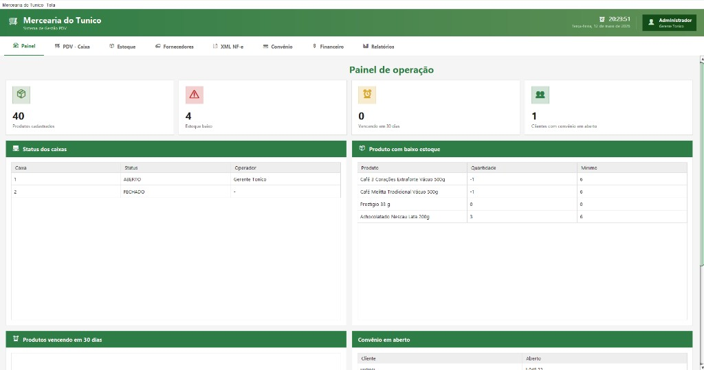

## Destaques

- PDV desktop com venda rapida, leitor de codigo de barras, carrinho, troco e pagamento combinado.
- Controle de caixa com abertura, sangria, suprimento, cancelamento e fechamento.
- Estoque com busca inteligente, entrada manual, ajuste, perda/quebra e historico de movimentacoes.
- Importacao de XML NF-e com previa, leitura de itens e baixa automatica no estoque.
- Cadastro de fornecedores com dados fiscais e apoio a entrada de mercadorias.
- Convenio de clientes com limite, compras em aberto e baixa parcial.
- Financeiro com contas a pagar/receber, baixas e lancamentos gerados por estoque/XML.
- Relatorios de vendas, estoque, ranking de produtos e curva ABC.
- Login com perfis `ADMIN`, `GERENTE`, `CAIXA` e `ESTOQUE`.
- Senhas com bcrypt e autorizacoes sensiveis por senha real de ADMIN/GERENTE.
- Backup/restore local e pacote final limpo para Windows.

## Prints reais do sistema

As imagens abaixo foram capturadas do sistema desktop em execução.

### Login e seguranca

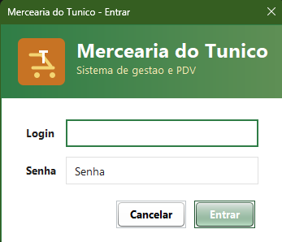

Tela de entrada com identidade visual da Mercearia do Tunico e campos de login/senha.

### Painel de operacao


Resumo inicial com produtos cadastrados, estoque baixo, vencimentos, clientes em convenio e status dos caixas.

### PDV - Caixa

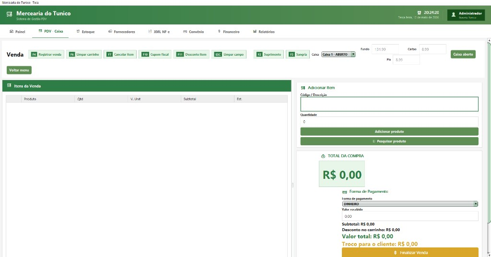

Tela principal de venda, com atalhos de caixa, itens da venda, busca de produto, total da compra e formas de pagamento.

### Estoque - cadastro e produtos

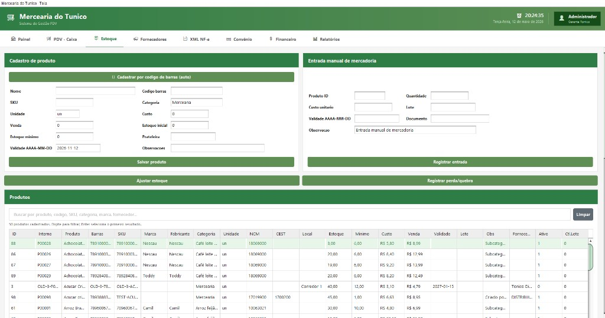

Cadastro de produto, entrada manual de mercadoria, ajuste, perda/quebra e tabela de produtos com busca inteligente.

### Estoque - movimentacoes, precos e validade

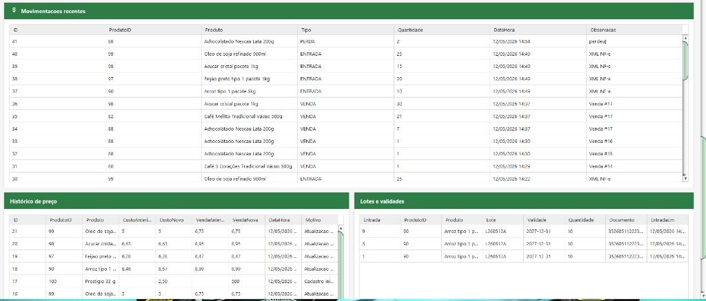

Historico operacional de movimentacoes, alteracoes de preco e controle de lotes/validades.

### Fornecedores

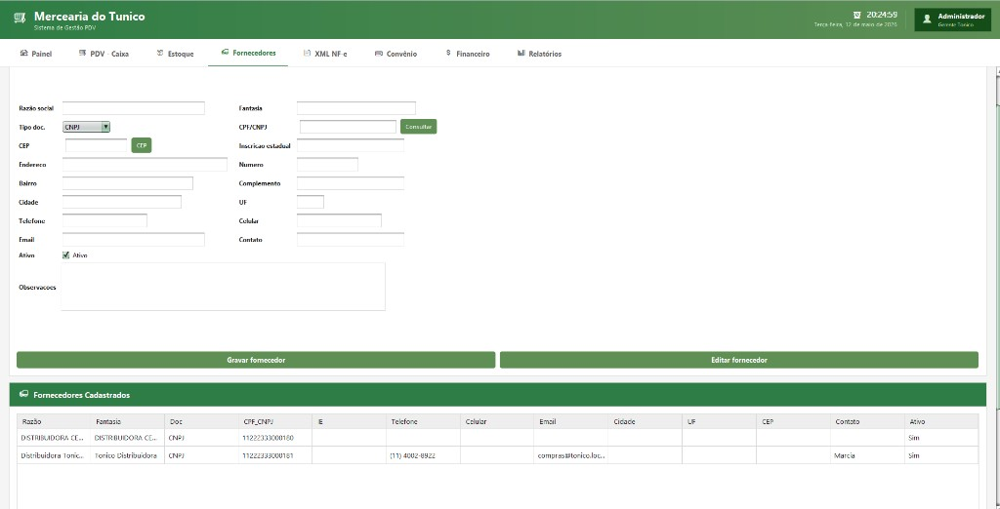

Cadastro completo de fornecedores, incluindo documento, endereco, contato e listagem dos fornecedores cadastrados.

### XML NF-e

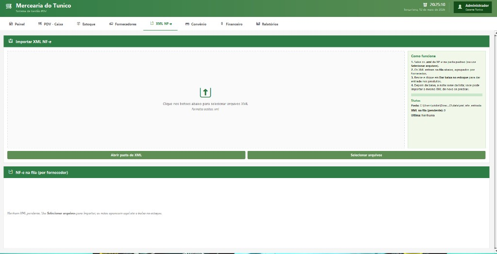

Area para importar XML de NF-e, selecionar arquivos, acompanhar status e preparar entrada automatica no estoque.

### Convenio

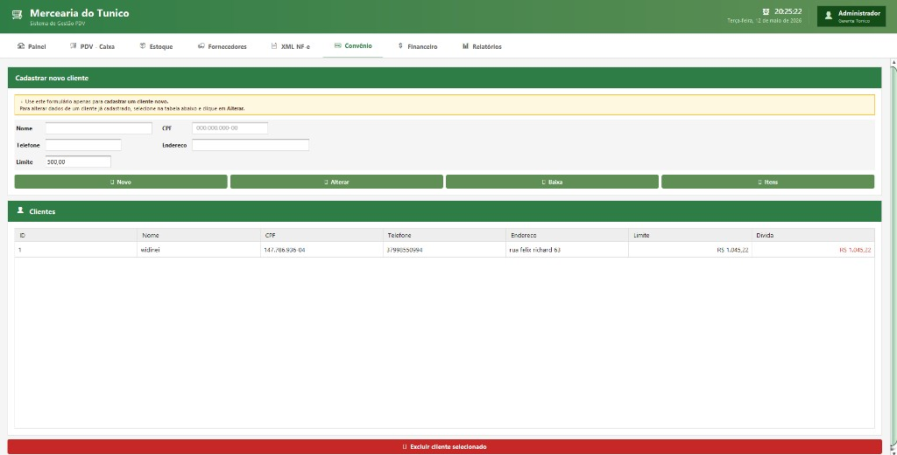

Cadastro e controle de clientes no convenio, limite, divida, alteracao, baixa e consulta de itens.

### Financeiro

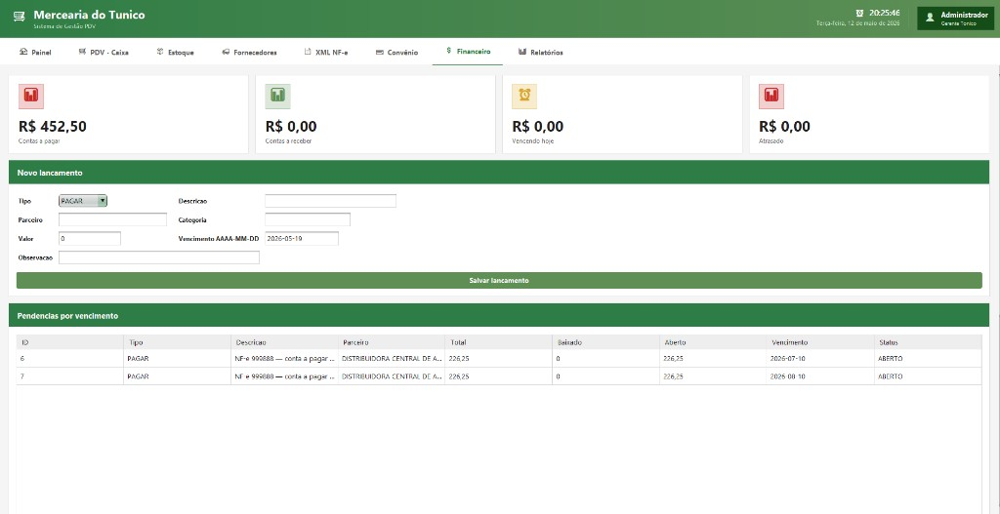

Visao de contas a pagar/receber, vencidos, atrasados, novo lancamento e pendencias por vencimento.

### Relatorios gerenciais

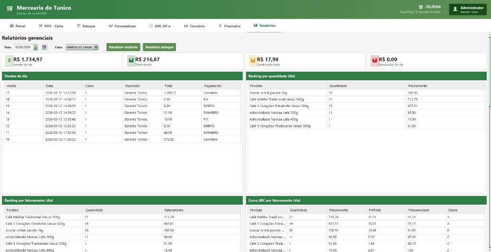

Relatorios de vendas, ticket medio, cartao, devolucoes, ranking por quantidade, ranking por faturamento e curva ABC.

### Relatorios - fechamento e operacoes de caixa

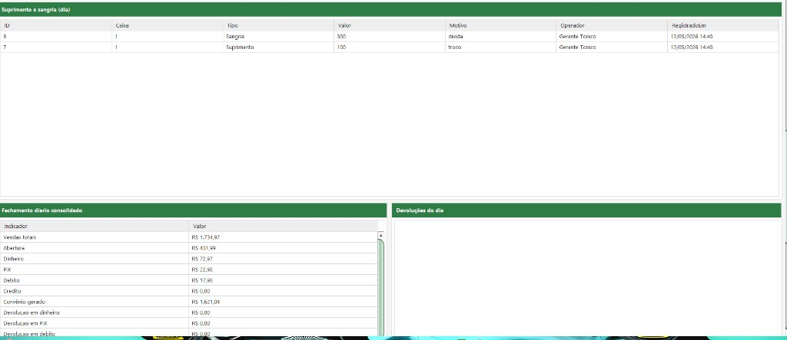

Detalhamento de suprimento/sangria, fechamento diario consolidado e devolucoes do dia.

## Tecnologias

- Java 17
- Java Swing
- SQLite
- JDBC
- Maven
- JUnit 5
- BCrypt via Spring Security Crypto
- OpenPDF para comprovantes
- Jackson para leitura de JSON em integracoes auxiliares

## Como executar

Requisitos:

- Java 17 ou superior
- Windows para os scripts `.bat`/`.vbs`
- Maven Wrapper ja incluido no projeto (`mvnw.cmd`)

Gerar o JAR:

```powershell
.\mvnw.cmd -DskipTests package
```

Abrir no modo desktop:

```powershell
java --enable-native-access=ALL-UNNAMED -jar target\mercado-do-tunico-1.0.0.jar
```

Abrir pelo pacote Windows:

```text
ABRIR_SERVIDOR_CAIXA.vbs
```

O banco local padrao fica em:

```text
data/mercado-tonico.db
```

## Acessos iniciais para demonstracao

Administrador:

```text
login inicial: admin
senha inicial: admin123
PIN inicial: 1234
```

Gerente:

```text
login: gerente
senha: gerente123
PIN gerente: 4321
```

Caixa:

```text
login: caixa1
senha: caixa123
```

Estoque:

```text
login: estoque1
senha: estoque123
```

No primeiro acesso, o sistema exige troca de senha. Antes de qualquer uso real, as senhas iniciais devem ser alteradas.

## Validacao

Rodar testes automatizados:

```powershell
.\mvnw.cmd test
```

Rodar validacao completa no Windows:

```text
VALIDAR_SISTEMA.bat
```

Ultima validacao realizada:

```text
Tests run: 33
Failures: 0
Errors: 0
Build: SUCCESS
```

## Estrutura principal

```text
src/main/java/br/com/mercadotonico
  core       regras compartilhadas e autorizacoes
  db         migracoes e inicializacao do banco
  desktop    aplicacao Java Swing
  tools      utilitarios de seed/importacao

src/main/resources/db/migration
  SQL versionado para schema e dados iniciais

docs
  documentacao, rede 2 caixas, backup/restore e galeria
```

## Funcionalidades de negocio

- Venda com multiplas formas de pagamento.
- Controle de estoque com saldo, minimo, validade, movimentacoes e perdas.
- Baixa de perdas/quebras com reflexo financeiro.
- XML NF-e para entrada de mercadoria.
- Convenio de clientes com limite e prazo.
- Relatorios gerenciais para acompanhamento do dia.
- Curva ABC e ranking de produtos por faturamento/quantidade.
- Backup manual simples para rotina de loja.

## Observacao sobre portfolio

Este repositorio mostra o sistema completo com codigo-fonte, testes, documentacao e prints reais da aplicacao. O foco e demonstrar regras de negocio, experiencia de uso, persistencia local, empacotamento Windows e evolucao de um sistema desktop realista.
